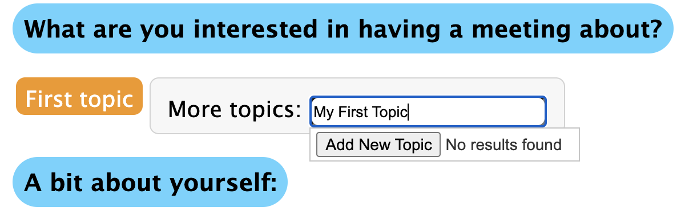
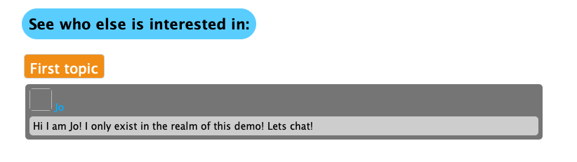
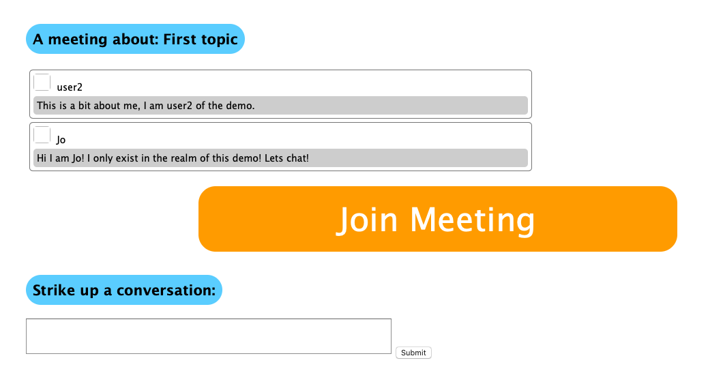
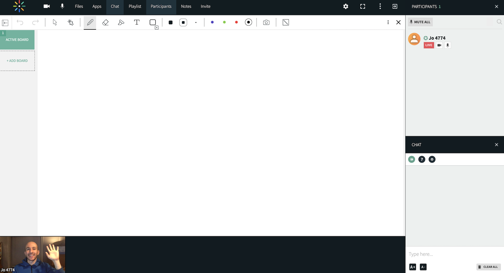

# Meetabout

The *Meetabout* application facilitates virtual meetings between strangers to discuss commonly interested topics. For example, consider the scenario "Let's meet to talk about X". *Meetabout* leverages the easy-to-use [Virtual Meeting Room API](https://github.com/kaltura-vpaas/virtual-meeting-rooms) to host the meeting on the Kaltura platform.

## Getting Started

### Things to Know

This is a sample application and is not intended to run in a production environment in it's current state.

### Prerequisites

1. [Nodejs](https://nodejs.org/en/) 
2. MongoDB: recommended to use the [free, hosted cloud Mongo service](https://www.mongodb.com/)
3. A Kaltura account. Create a free account [here](https://corp.kaltura.com/video-paas/registration/).
4. Send an email to <vpaas@kalutra.com> to activate Meetings on your Kaltura account.

### Install and Run

1. Clone the [Meetabout Github Repo](https://github.com/kaltura-vpaas/meetabout) 
2. Run `npm install`
3. Copy `.env.template` to `.env` and populate the following required fields (other fields in the file are not required to run this app):

```
SESSION_SECRET= #randomstring
SERVER_HOST_URL=http://localhost:3000
MONGO_URI= #mongodb+srv://
KALTURA_SERVICE_URL=https://www.kaltura.com
KALTURA_ADMIN_SECRET= #obtained from https://kmc.kaltura.com/index.php/kmcng/settings/integrationSettings
KALTURA_PARTNER_ID=#obtained from https://kmc.kaltura.com/index.php/kmcng/settings/integrationSettings
KALTURA_USER_ID=#set it to a user designated as admin. A user ID can be an email or other alpha numeric string.
```

4. Run the app: `npm start`

### Logging In

*Meetabout* requires a logged-in user to work. Any attempt to execute the app will force a modal login window to appear. The default login method uses *passportjs* local strategy, which is completely insecure and therefore you should only run this on your local machine. Of course this approach does make it very easy to quickly get up and running.

**Note:** If you want to run *Meetabout* as a production app, comment out `router.post('/', ` in `routes/auth_local.js` and implement other authentication strategies. For example, the GitHub, LinkedIn, Microsoft and Google oauth strategies are implemented in `routes/auth_<x>` and you can uncomment those routes from `app.js`. You would also need to create oauth credentials of your own for those services and supply the keys in `.env`.

Once logged in, you can begin using the app!

### Adding a Topic

Begin by creating a topic to have a meeting about! Enter a topic into "More Topics" and press "Add New Topic".



### Finding a Meeting

 When clicking on the "Find Meetings" button, there will not be anyone to meet with. To find a (pseudo) partner, open another browser, login with a different user, and subscribe to "First Topic" with both users. After both users join, they will be able to see one another!

The UI will look similar to this:



Click on the other user to go to the meeting page.

## A Meeting!

The meeting page is the location within *Meetabout* where meetings take place on a given topic. It consists of:

1. Descriptions of the users in the meeting
2. A Join Meeting button
3. A chat area where users can chat with each other via email and come back to this meeting page when a new message occurs.  Some setup is required to get the chat feature to work, which will be covered later.

A meeting page will look like so:



If any user on this meeting page clicks on the "Join Meeting" button, they will enter a live, virtual meeting room:


### Setting Up a Meeting: Beneath the Hood

A Kaltura virtual meeting room is created and joined through a series of API calls, which are described in detail in the [integration guide](https://github.com/kaltura-vpaas/virtual-meeting-rooms). The [Virtual Room Manager App](https://github.com/kaltura-vpaas/liveroom_manager) is another helpful tool to understand it's usage.

Now, let's walk through the Meetings API, as it relates to *Meetabout*.

To create a new meeting, we are routed to [/routes/meetings.js](https://github.com/kaltura-vpaas/meetabout/blob/master/routes/meetings.js) which calls the `createRoom` function in [/lib/createroom.js](https://github.com/kaltura-vpaas/meetabout/blob/master/lib/createroom.js):

```javascript
 createRoom(topicName, function (kalturaResponse) {
```

`kaltura.services.session.start` creates a [Kaltura Admin Session](https://github.com/kaltura-vpaas/virtual-meeting-rooms#creating-an-admin-session) which is needed to [create the virtual room](https://github.com/kaltura-vpaas/virtual-meeting-rooms#creating-a-resource):

```javascript
// Create the virtual room
let scheduleResource = new kaltura.objects.LocationScheduleResource();
scheduleResource.name = topicName;
scheduleResource.tags = "vcprovider:newrow";

kaltura.services.scheduleResource.add(scheduleResource)
.execute(client)
```

Notice that the topicName from *Meetabout* is passed as the topic of the Virtual Room.

The call to `kaltura.services.scheduleResource.add(scheduleResource)` creates a `resource`, which is Kaltura's terminology for a virtual room. The resource has an ID which is saved to the Mongo `Meeting` Model in [/routes/meetings.js](https://github.com/kaltura-vpaas/meetabout/blob/master/routes/meetings.js)

```javascript
createRoom(topicName, function (kalturaResponse) {
      new Meeting({
        topic: topicId,
        user1: uid1,
        user2: uid2,
        kalturaResourceId: kalturaResponse.id
      }).save(function (err, doc) {
```

The virtual meeting room has now been created and is ready to be used!

### Joining the Virtual Meeting Room

Some preparation is needed to join the `resource` or virtual meeting room that was created. The room needs to know your identity, as well as the type of user that you are. Kaltura can designate meeting users as either admins or viewers, where the admins are entitled with special privileges. However, in the case of *Meetabout*, the assumption is that both users are equals and thus both will be designated as admins.

In order to identify a user to the room, we need to create a [Kaltura Session](https://github.com/kaltura-vpaas/virtual-meeting-rooms#creating-a-kaltura-session) with some metadata related to the Virtual Meeting Room API.

This is kicked off from [/routes/meetings.js](https://github.com/kaltura-vpaas/meetabout/blob/master/routes/meetings.js) right after `.save` from above by calling:

`  joinRoom(kalturaResponse.id, user.name, user.email, function (joinLink) {`

This then calls [/lib/joinroom.js](/lib/joinroom.js) to create a [Kaltura Session](https://github.com/kaltura-vpaas/virtual-meeting-rooms#creating-a-kaltura-session) which is used to authenticate the user that clicked the "Join Meeting" button.

The url scheme for the room follows the [convention for virtual meeting rooms](https://github.com/kaltura-vpaas/virtual-meeting-rooms#creating-the-virtual-meeting-room-url) and is created in [/lib/joinroom.js](/lib/joinroom.js):

```javascript
let roomUrl = "https://" + partnerId + ".kaf.kaltura.com/virtualEvent/launch?ks=" + result;
```

The `ks` is a string representing the `Kaltura Session` for the user for this meeting room. And the `partnerId` is your Kaltura VPaaS account's partner ID. 

And that is it! The URL is ready to use to join the room! It is passed back to the meeting webpage and into the *href* of the "Join Meeting" button!

#### Email Setup

Note: this step is unrelated to the usage of the Kaltura Virtual Room API

A production app would use an smtp server at a company, or an smtp service. For testing purposes, you can sign up for a free account at [ethereal](https://ethereal.email/) and fill out the following fields in `.env`:

```
SMTP_HOST=smtp.ethereal.email
SMTP_USER=
SMTP_PASS=
SMTP_PORT=587
```
